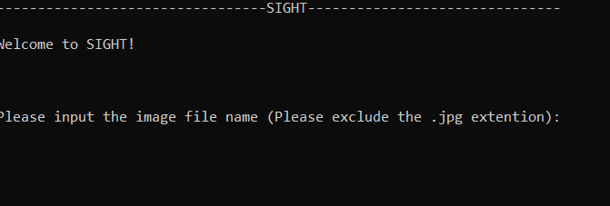
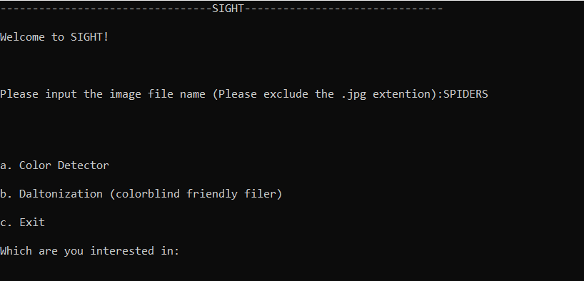
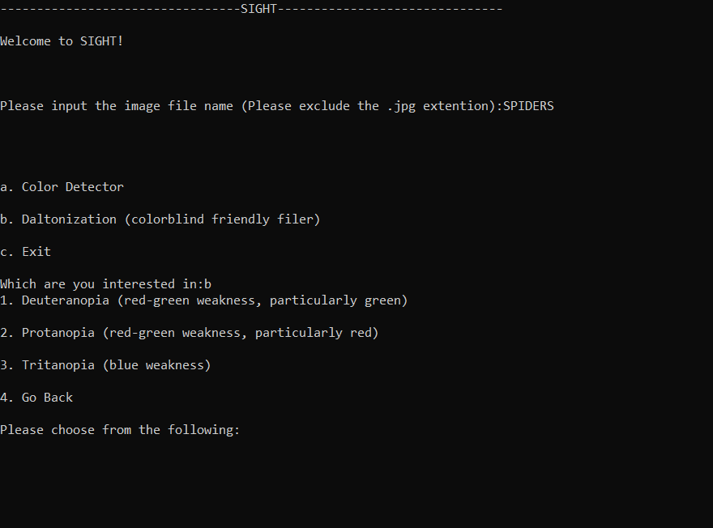
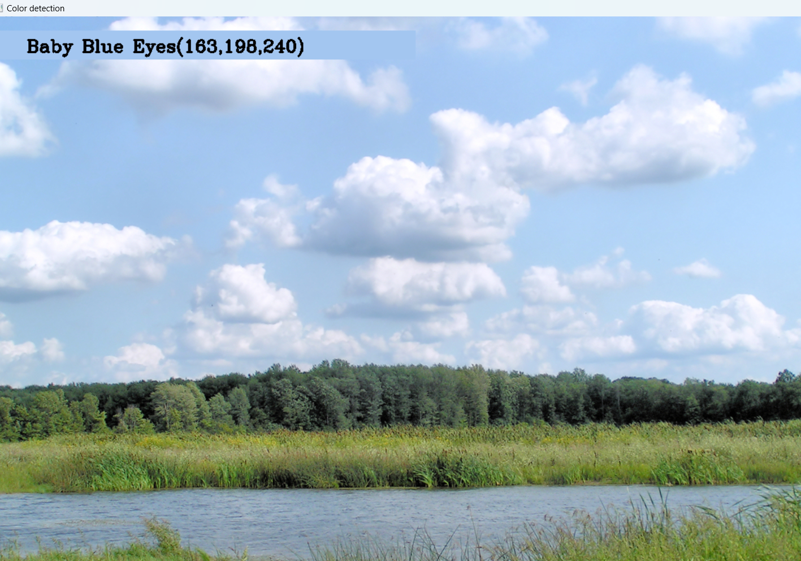
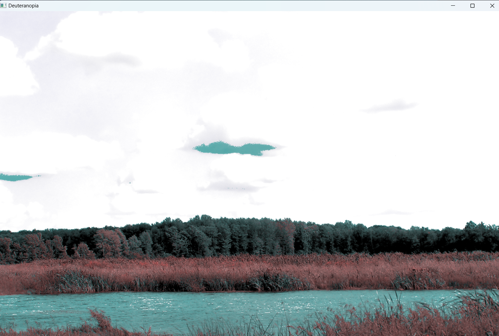

# SIGHT: The Color Detection and Colorblind support program for Images
 > Author: [Byron Rios](https://github.com/br26244)

## Project Description

 #### Intrest/Importance

 This project began with my struggles with colorblindness. My inability to distinguish certain colors, especially as an artist, became a growing struggle. This software both seeks to be a response to that, which will help with my use of reference images, or just for general use in life. I hope that this program serves other as well.
 

 #### languages/tools/technologies

[Python](https://www.python.org/): The project's primary language is Python

[IDLE](https://www.python.org/): IDLE will be used as a text editor as well as a terminal to test code

[Git](https://git-scm.com/): Git is used to make edits to our Github repository

[Github](https://github.com/): Github is a version control system that allows users to work together on shared code. Github also includes a project board for organizing implementations

[OpenCV](https://opencv.org/): One of the main tools/modules used for this program is OpenCV

[Colorblind](https://gitlab.com/FloatFlow/colorblind): The module Colorblind was also a great support in gaining all the hue values for the images

 #### input/output
Users will input the JPG name without the extension, and choose between the implemented features

The output will be on an extended window with the selected feature

#### Features
SIGHT currently has 2 main features. Its first is "Color Detection" Which allows the user to click anywhere on the provided image screen, prompting the RGB values and color name to be displayed. The second feature is Daltonization, which currently supports Protanopia, Deuteranopia, and Tritanopia. This is currently a hit-or-miss feature.

 #### Setup

 Simply download the release and create a folder to place the executable in. Currently, SIGHT only supports JPGs, therefore move all JPGs into the same folder as the executable. Run the executable and input the file name, and you're ready to go

 

 
